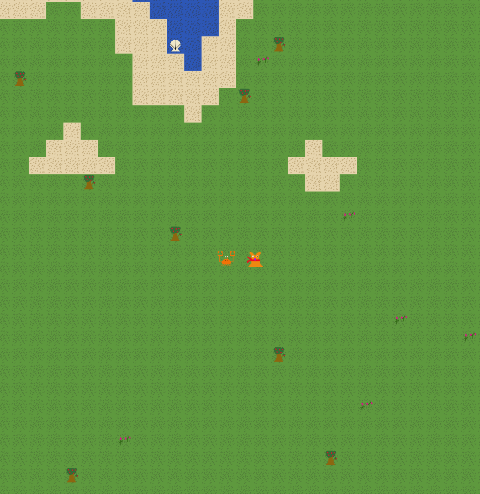

# Pyddelovs Quest
You are a small, cold fox and the graphics are very confusing. Will you collect all treasures before you get eaten?


## Gamplay
Collect shells, flowers, and bread to gain points. Krabban klo will spawn every few items collected and chase you until death. For defense, you can press space to fire a void bolt, destroying anything in its path.




## Building
`SDL2` is used for graphics, so this needs to be installed. I haven't looked into static linking, so the makefile will install them globally. If you run into permission issues, this is why.

```
make install
make build

```